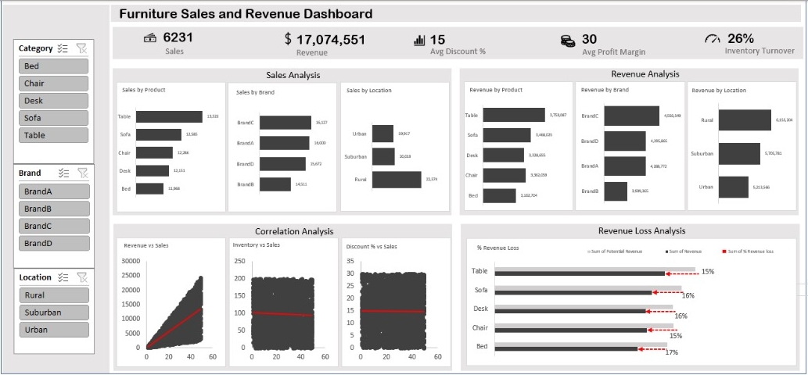

  # Furniture-Analysis
  
  
  Furniture Sales and Revenue Dashboard Analysis
  
  ##**Introduction##
  This Analysis designed to offer a comprehensive overview of sales performance within a furniture business. It focuses on key metrics such as total sales, revenue, average discount percentage, average profit margin, and inventory turnover. The dashboard also breaks down sales and revenue by various dimensions like product, brand, and location, and includes analyses on correlations and potential revenue loss. **It serves as a tool for business stakeholders to monitor performance, identify trends, and make informed decisions regarding sales, marketing, and inventory management**.
  
  ##**Problem Statement**
  This Analysis appears to address several critical business problems for a furniture company:
  1.  Performance Monitoring: To track and understand overall business health by monitoring key sales and financial metrics (sales volume, revenue, profit margin).
  2.  Product Performance Assessment: To identify which furniture products and brands are performing well or poorly in terms of sales and revenue, guiding product development, procurement, and marketing strategies.
  3.  Geographic Performance Analysis: To understand sales and revenue performance across different locations (Rural, Suburban, Urban), informing targeted marketing efforts, store expansion, or resource allocation.
  4.  profitability Analysis: To monitor the average profit margin and identify potential areas of revenue loss, crucial for financial health and pricing strategies.
  
  ##**Skill Demonstrated**
  The creation of this dashboard showcases a range of analytical and technical skills:
  1  KPI Definition and Calculation: Ability to define and calculate key performance indicators (KPIs) relevant to sales and finance.
  2  Dimensional Analysis: Breaking down core metrics (Sales, Revenue) across various dimensions (Product, Brand, Location) demonstrates structured analytical thinking.
  3  Correlation Analysis: Including scatter plots to show relationships between variables (Revenue vs. Sales, Inventory vs. Sales, Discount % vs. Sales) indicates an understanding of statistical analysis.
    4  Problem-Solving (Revenue Loss): Identifying and quantifying "Revenue Loss" demonstrates a proactive approach to identifying areas for improvement.
  
  Data Visualization
   
  
  Proficient use of various chart types (bar charts, scatter plots, KPI cards) to effectively communicate different types of information.
  
  Dashboard Design: Logical grouping of related analyses (Sales Analysis, Revenue Analysis, Correlation Analysis, Revenue Loss Analysis) and interactive filters for user exploration.
  
  Data Interpretation: The ability to present data in a way that allows users to quickly extract insights and draw conclusions.
  
  Data Transformation
  
  The dashboard's design implies several data transformation steps:
  
  Aggregation: Summing up individual sales transactions to calculate "Total Sales," "Total Revenue," "Sum of Potential Revenue," and "Sum of Revenue Loss." Averaging for "Avg Discount %" and "Avg Profit Margin."
  
  Calculated Fields: Deriving metrics like "Avg Discount %," "Avg Profit Margin," and "Inventory Turnover." The "Revenue Loss Analysis" likely involves a calculated field for "Potential Revenue" (e.g., sales value at full price) and "Revenue Loss" (Potential Revenue - Actual Revenue).
  
  Categorization/Grouping: Grouping sales data by "Product," "Brand," and "Location" for the various bar charts.
  
  Data Cleaning: Ensuring that product names, brand names, and location data are consistent and accurate for effective grouping.
  
  Relationship Establishment: Linking different tables (e.g., sales transactions, product master, location master) to enable cross-dimensional analysis.
  
  Data Modelling
  
  A well-structured data model is clearly implied by the dashboard's interactive nature and cross-dimensional reporting. It likely follows a star or snowflake schema, with:
  
  Fact Table (e.g., Sales Transactions): Containing individual sales records, including columns like Sales_Quantity, Revenue, Discount_Percentage, Profit_Margin, Product_ID, Brand_ID, Location_ID, Date.
  
  Dimension Tables:
  
  Product Dimension: Product_ID, Product_Name, Category (Bed, Chair, Desk, etc.).
  
  Brand Dimension: Brand_ID, Brand_Name.
  
  Location Dimension: Location_ID, Location_Type (Rural, Suburban, Urban).
  
  Date Dimension: Date, Year, Month, Day, etc. (though not explicitly filtered by date range, time-based metrics would require this).
  
  The filters on the left-hand side for "Category," "Brand," and "Location" directly correspond to attributes in these implied dimension tables, allowing users to slice the fact data.
  
  Analytics and Visualization
  
  Analytics:
  
  KPI Monitoring: The top section effectively uses large, clear numbers to highlight critical KPIs at a glance.
  
  Sales & Revenue Breakdown: The dashboard provides a granular view of sales and revenue performance across products, brands, and locations, enabling easy identification of top and bottom performers.
  
  Correlation Analysis: The scatter plots offer visual insights into potential relationships between variables, which is valuable for understanding drivers. For instance, the "Revenue vs Sales" plot shows a strong positive linear relationship, as expected. The "Inventory vs Sales" and "Discount % vs Sales" plots indicate less obvious or weaker correlations, which is also an important finding.
  
  Loss Analysis: The "Revenue Loss Analysis" is a proactive analytical component, directly quantifying lost revenue by product, which is highly actionable.
  
  Visualization:
  
  Consistent Layout: The dashboard maintains a consistent and clean layout, with filters on the left and analytical sections arranged systematically.
  
  Chart Variety: Appropriate use of different chart types:
  
  Bar Charts: Excellent for comparing discrete categories (Sales/Revenue by Product, Brand, Location). The horizontal bars work well for product/brand names.
  
  KPI Cards: Effective for highlighting single, important numbers at the top.
  
  Scatter Plots: The best choice for visualizing relationships and potential correlations between two continuous variables.
  
  Color Scheme: The use of a simple, muted color scheme (greys, dark blues, reds for loss) is professional and minimizes distractions, keeping the focus on the data.
  
  Clarity of Labels: Chart titles and axis labels are clear and concise, making the dashboard easy to interpret.
  
  Revenue Loss Visualization: The "Revenue Loss Analysis" chart is particularly effective, using a red indicator to highlight the lost percentage against the potential revenue bar.
  
  Feedbacks
  
  Correlation Interpretation: While scatter plots are present, explicitly stating the R-squared value or correlation coefficient on the plots would provide a more quantitative measure of the relationship strength, especially for "Inventory vs Sales" and "Discount % vs Sales" where the visual correlation is not strong.
  
  Date/Time Filter: The dashboard lacks a specific date range filter, which is crucial for sales and revenue analysis. Without it, the data represents an aggregate over an unspecified period, limiting trend analysis over time. This is a significant omission for a sales dashboard.
  
  Profit Margin Breakdown: While "Avg Profit Margin" is a KPI, breaking down "Profit Margin by Product," "Brand," or "Location" (similar to Sales and Revenue analysis) could yield more actionable insights into profitability drivers.
  
  Context for KPIs: The KPIs (e.g., 26% Inventory Turnover) are presented as absolute numbers. Adding context such as benchmarks, targets, or historical trends would make them more meaningful.
  
  Interactivity of Scatter Plots: While the dashboard itself is interactive with filters, the scatter plots would benefit from tooltip details on hover to show exact values for individual data points.
  
  Actionability of Revenue Loss: The "Revenue Loss Analysis" is great, but the dashboard could suggest the reason for loss (e.g., discounts, damaged goods, returns) if the underlying data supports it, making the insight more actionable.
  
  Recommendation
  
  Based on the dashboard's current state and insights, here are some recommendations:
  
  Implement Date Filtering: Add a robust date filter (e.g., date range slider, year/month selection) to allow users to analyze performance over specific periods and identify trends over time. This is critical for any sales dashboard.
  
  Deep Dive into Profitability: Introduce new visualizations showing "Profit Margin by Product," "Brand," and "Location." This will help identify which items or segments are most or least profitable and guide pricing and cost management decisions.
  
  Enhance KPI Context: For KPIs like "Avg Discount %," "Avg Profit Margin," and "Inventory Turnover," consider adding small trend lines (if historical data is available), comparisons to targets, or industry benchmarks to provide better context.
  
  Investigate Correlation Insights: Conduct further analysis on the "Inventory vs Sales" and "Discount % vs Sales" relationships. If there are weak correlations, investigate other factors influencing sales or re-evaluate inventory/discount strategies.
  
  Root Cause Analysis for Revenue Loss: For products with high "Revenue Loss," delve deeper into the reasons. Is it due to excessive discounting, damaged goods, returns, or other factors? This would require additional data points or reports.
  
  User Guidance for Filters: While the filters are present, a brief explanation of how to use them or their impact on the visualizations might be beneficial for new users.
  
  Challenges
  
  Creating this type of dashboard likely involved several challenges:
  
  Data Granularity and Integration: Ensuring sales data includes all necessary attributes (product, brand, location, discount, profit components, and the original/potential revenue) and integrating data from various sources (e.g., POS, e-commerce, inventory systems).
  
  Defining "Revenue Loss": Accurately defining and calculating "Potential Revenue" and "Revenue Loss" might be complex, depending on pricing strategies, promotions, and return policies.
  
  Data Quality: Maintaining clean and consistent data for product names, brands, and locations is crucial for accurate aggregation and filtering. Inconsistencies would lead to inaccurate analyses.
  
  Complex Calculations: Calculating metrics like "Avg Discount %," "Avg Profit Margin," and "Inventory Turnover" requires specific business rules and potentially complex formulas.
  
  Performance with Large Datasets: If the underlying sales data is very large, ensuring the dashboard remains responsive and loads quickly can be a technical challenge, requiring efficient data models and query optimization.
  
  Stakeholder Alignment: Ensuring that the chosen KPIs and analyses align with the key questions and decision-making needs of business stakeholders.
  
  Maintaining Up-to-Date Data: Establishing robust data pipelines to ensure the dashboard always reflects the most current sales and inventory information.
  
  The dashboard is a good start, providing clear insights into sales and revenue performance. Addressing the suggested improvements, particularly the inclusion of a date filter and deeper profitability analysis, would significantly enhance its utility for strategic decision-making.
